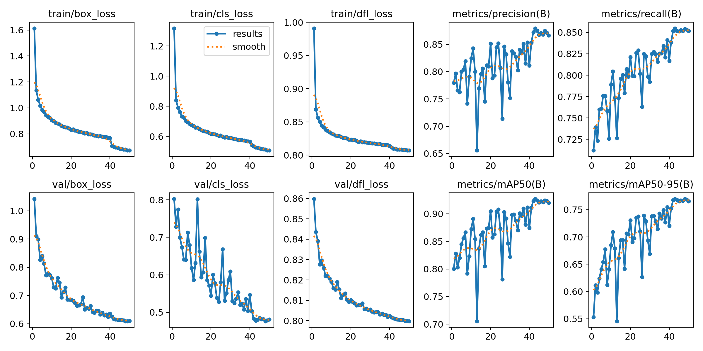
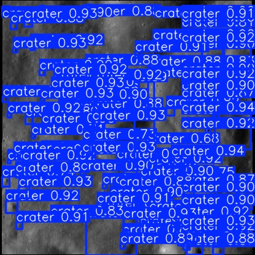
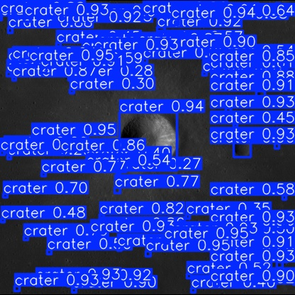
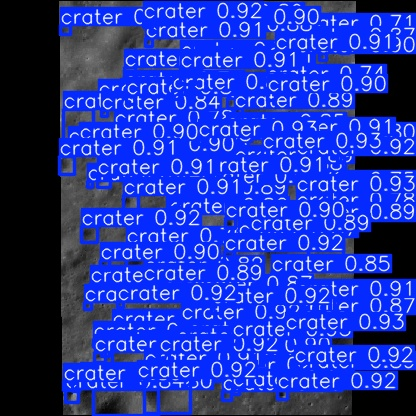

# 🌑 Ay Krateri Tespiti — YOLOv8 ile Nesne Tespiti

> YOLOv8 derin öğrenme modeli kullanılarak ay yüzeyindeki kraterlerin otomatik olarak tespit edilmesi.
> ## GitHub Repo
[github.com/wakeupsmarty/krater-tespiti](https://github.com/wakeupsmarty/krater-tespiti)

---

## Problem Tanımı

Ay yüzeyindeki kraterlerin tespiti, gezegen bilimi ve uzay araştırmaları açısından önemli bir problemdir. Manuel inceleme zaman alıcı ve hata payı yüksektir. Bu projede, derin öğrenme tabanlı nesne tespit yöntemi (YOLOv8) kullanılarak krater tespiti otomatikleştirilmiştir.

## Kullanılan Veri Seti

- **Ad:** LU3M6TGT — Lunar Crater Detection Dataset (YOLO format)
- **Kaynak:** [Kaggle](https://www.kaggle.com/datasets/riccardolagrassa/lu3m6tgt)
- **İçerik:** 8.756 eğitim, 1.545 doğrulama görüntüsü
- **Sınıf sayısı:** 1 (crater)

## Kullanılan Model ve Yöntem

- **Model:** YOLOv8n (Nano) — Ultralytics
- **Yöntem:** Transfer learning (ImageNet ağırlıklarından fine-tuning)
- **Eğitim:** 50 epoch, 640x640 görüntü boyutu, batch size 16
- **Framework:** PyTorch + Ultralytics

## Nasıl Çalıştırılır

### Gereksinimler
```bash
pip install -r requirements.txt
```

### Eğitim
```python
from ultralytics import YOLO

model = YOLO('yolov8n.pt')
model.train(
    data='dataset/LU3M6TGT_yolo_format/data.yaml',
    epochs=50,
    imgsz=640,
    batch=16,
    name='crater_detection'
)
```

### Tahmin
```python
model = YOLO('runs/detect/crater_detection/weights/best.pt')
results = model.predict(source='test_image.jpg', conf=0.25)
results[0].show()
```

## Sonuçlar

| Metrik | Değer |
|--------|-------|
| mAP50 | 0.924 |
| mAP50-95 | 0.769 |
| Precision | 0.875 |
| Recall | 0.853 |

Model, ay yüzeyindeki kraterleri yüksek güven skorlarıyla (0.90+) başarılı şekilde tespit etmiştir.

### Eğitim Grafikleri



### Tahmin Örnekleri





## Sınırlılıklar ve Geliştirme Önerileri

**Sınırlılıklar:**
- Yalnızca 1 sınıf (crater) tespit edilmektedir
- YOLOv8n (nano) kullanıldığından daha büyük modellere göre doğruluk düşük olabilir
- Colab ücretsiz GPU süresi kısıtlıdır

**Geliştirme Önerileri:**
- YOLOv8m veya YOLOv8l ile daha iyi sonuç alınabilir
- Epoch sayısı artırılabilir (100+)
- Farklı veri artırma (augmentation) teknikleri denenebilir
- Krater boyutuna göre sınıflandırma eklenebilir
